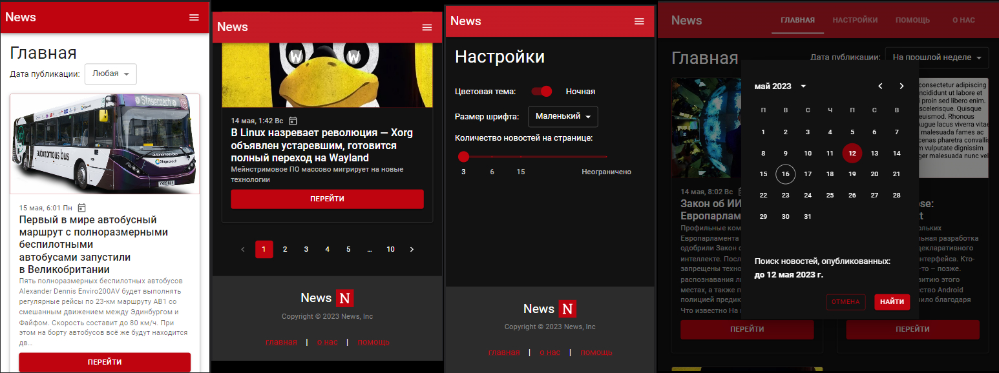

# SPA React JS | News app

## preview



## stack

<div align="left">
  
  
  
  
</div>

- React + Typescipt
- React-router-dom
- Redux toolkit
- MaterialUI
- newsAPI.org

## features

- change application font-size
- change page-size + infinity scrolling
- date filter
- pagination
- toggle theme-mode (dark | light)

## installation

```
git clone https://github.com/etherealHero/news-react
cd news-react/
npm i

npm run dev
```
